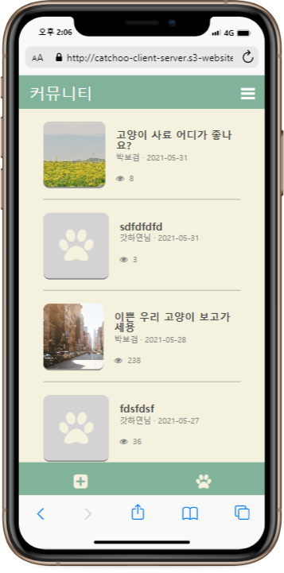
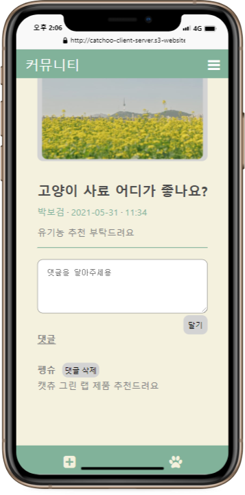
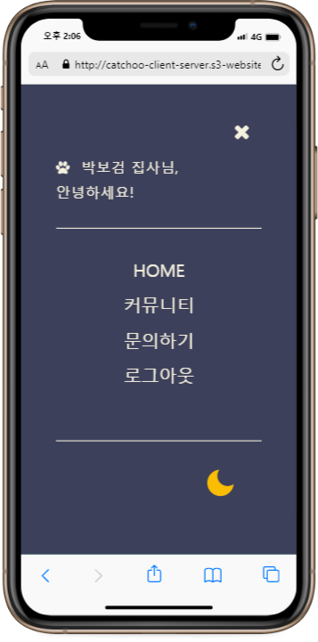
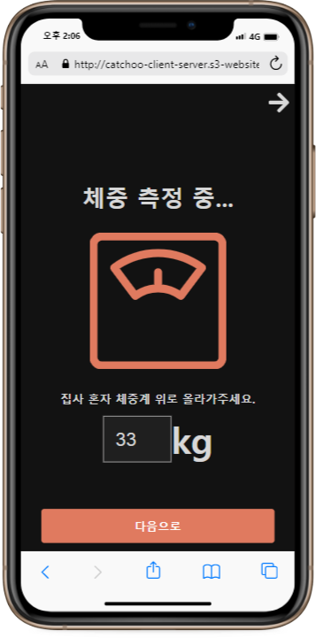
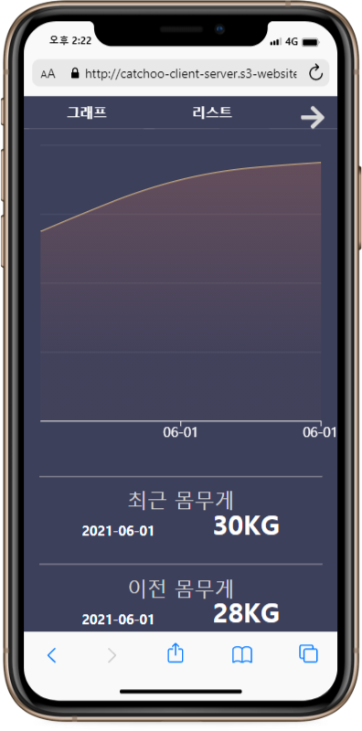

# Catchoo
집사님들을 위한 킹냥이 웹앱 😺
 

[*English*](https://github.com/asroq1/Project_Cats)

[React + Redux + Redux-Saga] + [Spring Boot + JPA + MariaDB]

[Catchoo 웹앱](http://catchoo-client-server.s3-website.ap-northeast-2.amazonaws.com/)

* 모바일 화면에 최적화되어 있습니다.

||
:---:|:---:|:---:
||
||

 

## 기능
1. 집사님 고양이들의 체중을 기록하세요
- 고양이의 목표 체중을 설정하세요
- 매일 고양이의 체중을 기록하고, 그래프 및 표로 체중 변화를 관찰하세요!
- 고양이 나이는 생년월일을 바탕으로 자동으로 계산됩니다

2. 회원가입도 쉬워요!
- 일반 회원가입 또는 소셜 (카카오) 회원가입으로 쉽게 서비스를 이용하세요!

3. 다른 집사님들과 소통하세요
- 공유하고 싶은 내용이나 사진들이 있나요? 자유게시판에서 마음껏 소통하세요.
- 정보를 구하는 글도, 내 고양이 이쁜 거 온 세상에 자랑하려는 글도 괜찮아요.  

## 기술 스택

- 프론트엔드: React + Redux (전역 상태 관리) + Redux-Saga (비동기 처리)
- 백엔드: Spring Boot + MariaDB

#### General
- RESTful API를 구현했습니다
- **JWT**를 통해 확장가능한 인증 시스템을 구현하였습니다 

#### Front-end
- **React**: 리렌더링과 앱 성능의 최적화
- **React-Hooks**: 상태와 라이프사이클 메서드 활용 및 재사용가능한 함수 선언
- **React-Router**: 라우팅과 링크 관리
- **Redux**: 전역상태 및 로직 관리
- **Redux-Saga**: 비동기 액션 흐름 관리
- 기타 라이브러리
  * _immer_: 상태의 불변성 (immutability) 유지
  * _Axios_: 프로미스 (Promise) 바탕의 HTTP 리퀘스트 관리
  * _Redux-Persist_: 페이지 리로드 후에도 상태를 유지하여 부드러운 앱 사용 가능. 로그아웃 시 루트 리듀서 초기화로 보안 강화
  * _Styled-component_: 불필요한 리렌더링 방지하며 정형화된 스타일링과 다크모드 적용
  * _React-Easy-Crop_: Canvas API 이용한 이미지 크롭 적용
  * _React-Slick_: 이미지 캐루셀 구현 (추후 게시글에 사용)
  * _Recharts_: 그래프 구현
  * _Font-Awesome_: 다양한 아이콘 사용

#### Back-End
- **Java**: 객체 지향 언어 사용으로 유연하고 확장성 있는 앱을 구현
- **Spring Framework**: used to simplify enterprise-level Java development and loose coupling of code by dependency injection and AOP.
- **Spring Boot** used to make development, testing, and deployment more convenient.
- **Spring Security** used to implement authentication, authorization, and protection against common attacks.
- **JPA(Hibernate)** used to manipulate data from database through an object-oriented program and improve productivity.
- **MariaDB** used to avoid data redundancy and data duplication.
- **Swagger UI** is implemented for better communication using APIs with Front-end team.
- Other Tools
  - *JUnit* used to write and run repeatable automated tests.
  - *Bean Validation* used to validate user input.
  - *Lombok* used to reduce boilerplate code for model/data objects. 
  - *Apache Commons Lang 3* used to manupulate core classes of Java APIs.

#### Deployment
- 프론트엔드 서버는 Netlify와 AWS에 배포하였습니다
- 백엔드 서버는 AWS에 배포하였습니다  

## Team Members
- 한국 개발자 커뮤니티 OKKY.kr를 통해 모인 두 명의 프론트엔드 개발자와 두 명의 백엔드 개발자에 의해 만들어진 프로젝트입니다.
- 2021년 3월 30일에 시작, 프로젝트를 구상하고 한달 반 정도의 시간동안 구현하였습니다. 필요에 따라 추가 기능 구현을 염두에 두고 있습니다.
- Slack을 통해 매일, Zoom을 통해 매주 소통하며 개발했습니다.
- **Front-end**: HS, HR
- **Back-end**: HY, SH  
