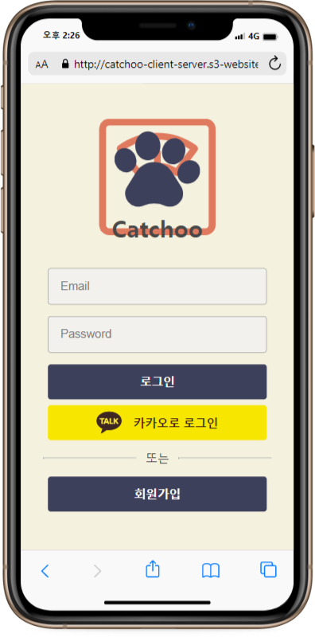
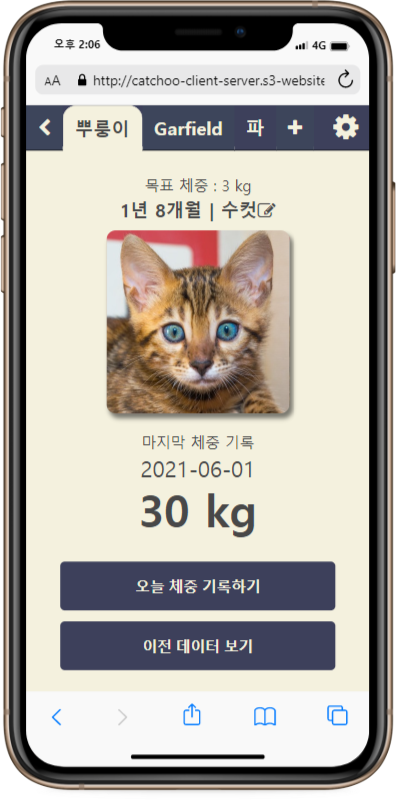
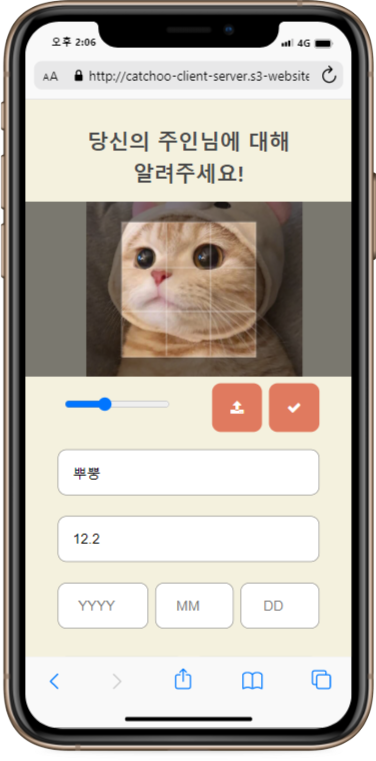
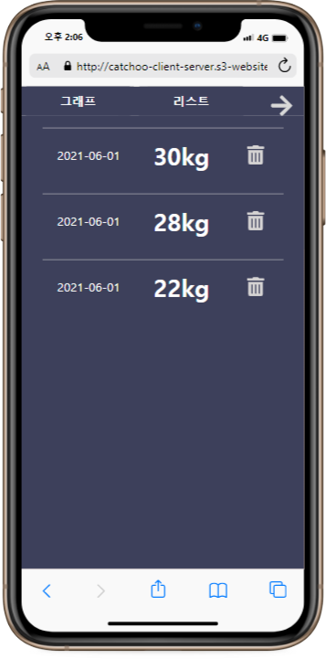

# Catchoo
Web App for Cat Lovers. 😺
 

[*한글*](https://github.com/asroq1/Project_Cats/blob/master/README.ko.md)

Built with [React + Redux + Redux-Saga] + [Spring Boot + JPA + MariaDB]

[Catchoo Web App](http://catchoo-client-server.s3-website.ap-northeast-2.amazonaws.com/)

* Layout optimized for mobile screen

||
:---:|:---:|:---:
||
||

 

## Functionalities
1. Track Weight of Your Cats
- Measure and record your cat's weight every day to track it in graphs or tables.
- Your cat's age is automatically calculated with its birthdate.

2. Registration Made Easy
- Register as a user using a regular or social login (Kakao) option!

3. Share Your Stories with Other Cat Lovers
- Post any stories and photos you want to share with other users.
- Whether it be to show off your cat's beauty or to ask questions, this app is here for you!  

## Tech Stack

- Front-end: React + Redux (State Management) + Redux-Saga (Async Actions Management)
- Back-end: SpringBoot + MariaDB

#### General
- Implemented RESTful Routes 
- **JWT** used to ensure scalability with a potential increase in the number of users. 

#### Front-end
- **React** used to optimize rerendering and app performance.
- **React-Hooks** used to implement states and life cycle methods while using functional components for reusable and simple codes.
- **React-Router** used to manage routes and links.
- **Redux** used to centralize the states and logics of the app and to manage them easily.
- **Redux-Saga** used to manage asynchronous action flows.
- Other Tools
  * _immer_ to ensure immutability of states.
  * _Axios_ to handle HTTP requests based on promises.
  * _Redux-Persist_ to maintain states even after page reloads. Root state is purged after logout to ensure security.
  * _Styled-component_ to style components without triggering unnecessary rerenders, to store the shared design elements, and to provide dark/light mode options.
  * _React-Easy-Crop_ to crop uploaded images.
  * _React-Slick_ to create image carousels.
  * _Recharts_ to create charts.
  * _Font-Awesome_  to use various icons.

#### Back-End
- **Java** used to develop object based apps, which is easier as it helps keeps the system flexible and extensible.
- **Spring Framework** used to simplify enterprise-level Java development and loose coupling of code by dependency injection and AOP.
- **Spring Boot** used to make development, testing, and deployment more convenient.
- **Spring Security** used to implement authentication, authorization, and protection against common attacks.
- **JPA(Hibernate)** used to manipulate data from database through an object-oriented program and improve productivity.
- **MariaDB** used to avoid data redundancy and data duplication.
- **Swagger UI** is implemented for better communication using APIs with Front-end team.
- Other Tools
  - *JUnit* used to write and run repeatable automated tests.
  - *Bean Validation* used to validate user input.
  - *Lombok* used to reduce boilerplate code for model/data objects. 
  - *Apache Commons Lang 3* used to manupulate core classes of Java APIs.

#### Deployment
- Front-end server deployed on Netlify (*temporary*) and AWS.
- Back-end server deployed on AWS  

## Team Members

- This project is being developed by (2) Front-end engineers and (2) Back-end engineers, gathered via Korean developers' online community - OKKY.kr.
- Project started on 03/30/21.
- Tool decision, task distribution, debugging, etc. discussed every day via Slack. Weekly zoom meetings held for deeper discussion and catch-up.
- **Front-end**: HS, HR
- **Back-end**: HY, SH  
